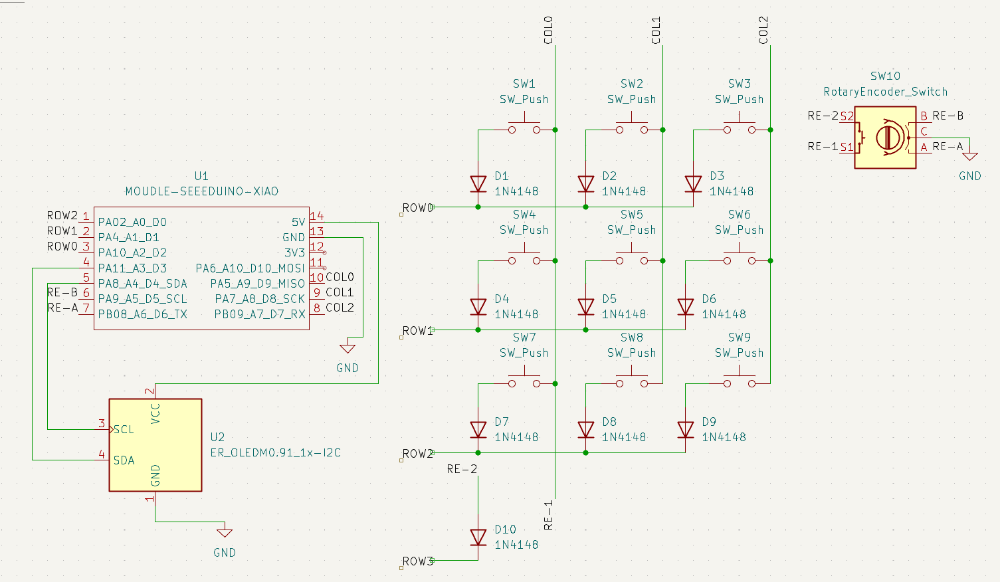
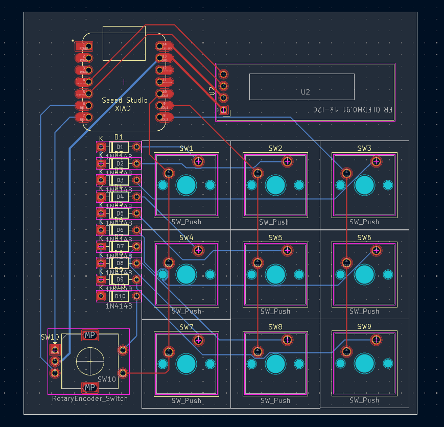
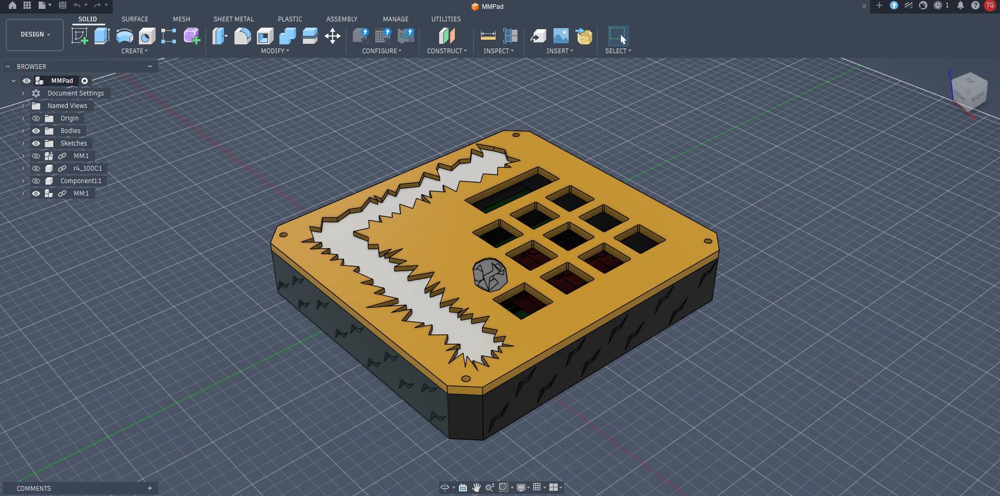
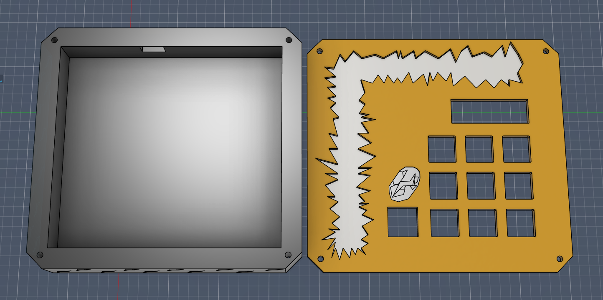
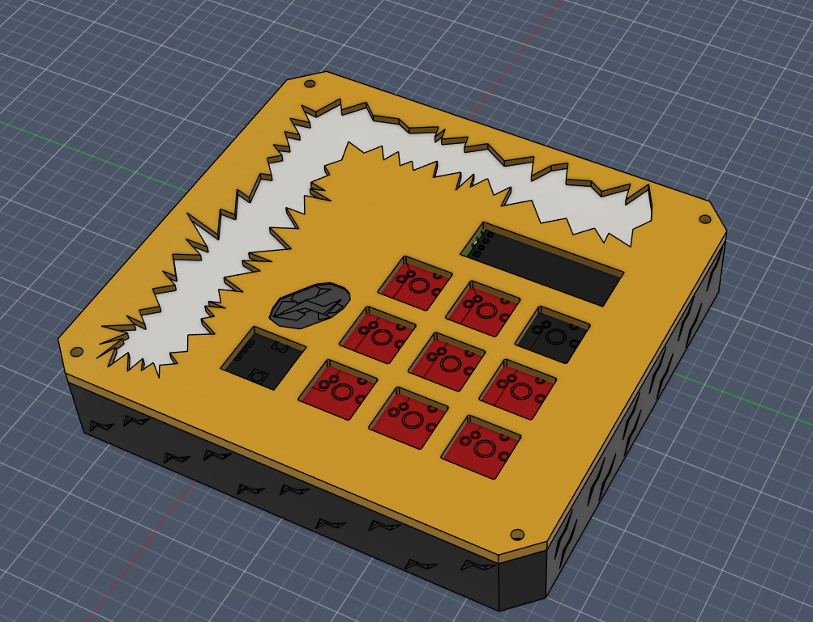

# MMPad
This is my first macro pad. Its a simple 3x3 grid of switches, with a rotary encoder and OLED display (which will likely be Jolteon). This project was really fun (and frustrating) to make, but I did learn a lot and hope to make an even better one in the future!
# PCB/Schematic
The PCB and Schematic were designed in Kicad.

# CAD
The case and plate were designed in Fusion360. 

## BOM
- 1x 0.96" OLED Screen - $3.90 on SeeedStudio
- 1x EC11 Rotary Encoder - $1.99 on Keebio
- 9x MX Switches - $0.99 on AliExpress (10-count Cherry MX Brown Switches)
- 10x 1N4148 Diodes - $2.99 on Keebio 
- 1x Seeed XIAO RP2040 $3.99 on SeeedStudio
- 9x DSA Keycaps - $0.99 on AliExpress (10-count DSA 1U Black Keycaps)
- 4x M3x16mm screws - $8.99 on Amazon
### Total is $23.84

